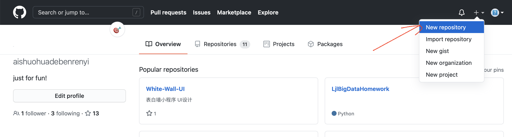
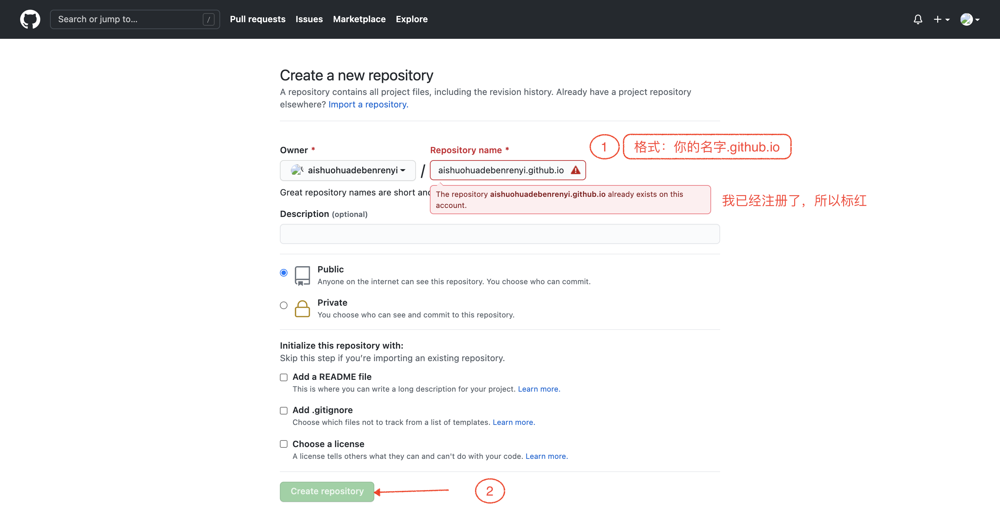
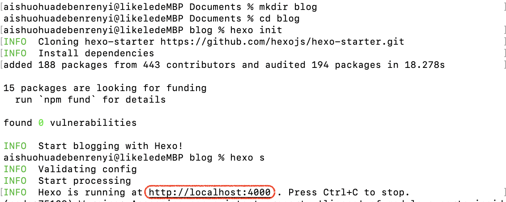
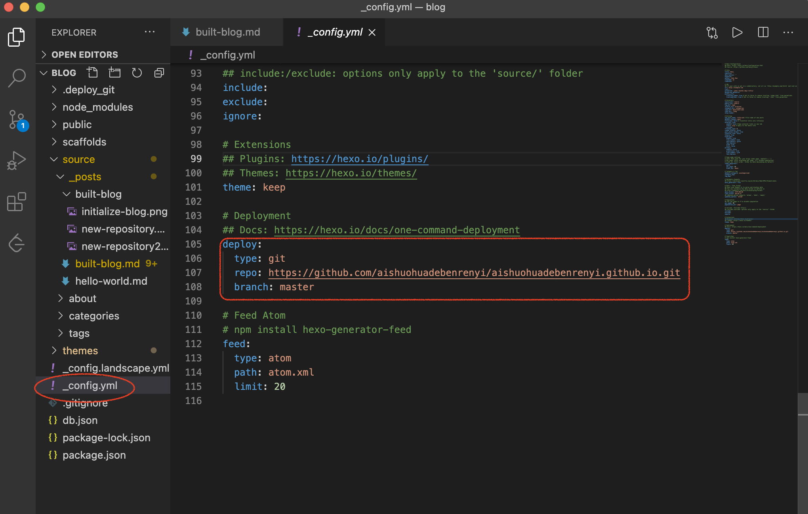
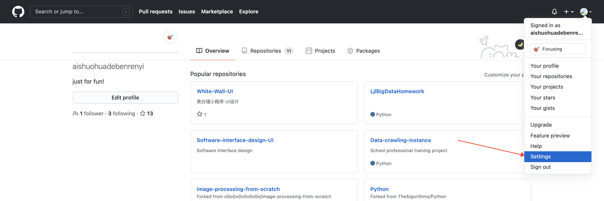
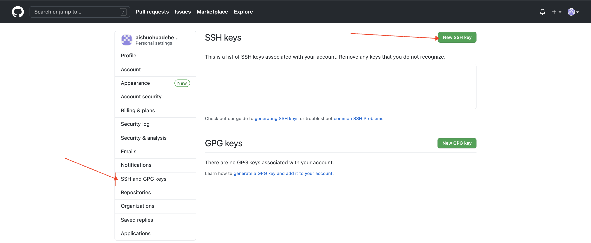
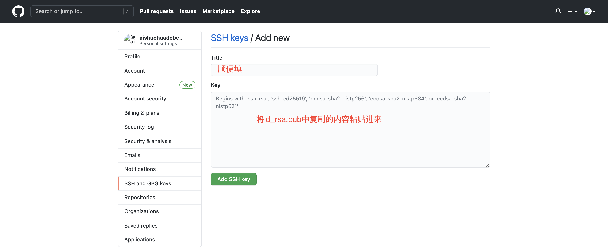
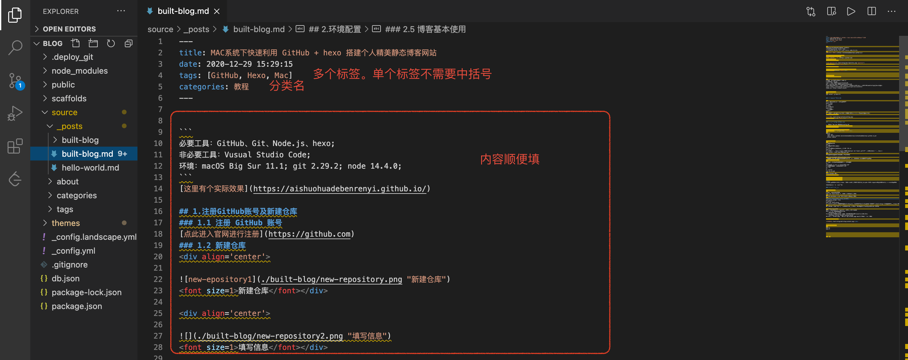
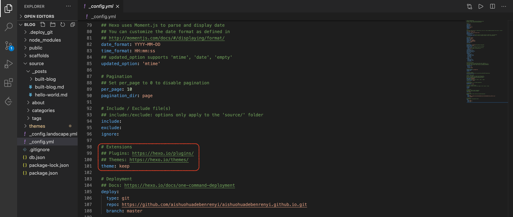

作者选择 hexo，主要是因为它简单易操作，有很多现存精美主题；选择keep模版主要是因为有搜索功能，万物皆可搜索，其主题简洁大方又五脏俱全。
```
必要工具：GitHub、Git、Node.js、hexo;
非必要工具：Vusual Studio Code;
环境：macOS Big Sur 11.1; git 2.29.2; node 14.4.0;
```
[这里有个实际效果](https://aishuohuadebenrenyi.github.io/)

## 注册GitHub账号及新建仓库
### 注册 GitHub 账号
[点此进入官网进行注册](https://github.com)
### 新建仓库



## 搭建博客框架
### 安装Git、Node.js

```
# 首先检查是否已安装git和node.js
# 终端输入一下命令
node -v #若出现版本信息，说明已安装
git --version #若出现版本信息，说明已安装
# 如果没有安装，则进行安装,都可以通过直接下载安装测序进行安装，这里不演示，提供下载网址：
[git]: https://sourceforge.net/projects/git-osx-installer/
[node.js]: https://nodejs.org/en/
```

### 安装hexo
```
npm install -g hexo-cli
```

### 搭建博客并初始化
```
# 在任意目录下创建一个blog文件夹
mkdir blog
# 进入目录
cd blog
# 初始化目录
hexo init
开启本地服务 
# hexo s
```
若出现红框中的网址，说明本地启动成功，可以在浏览器中输入该网址查看效果



### 博客关联到 GitHub 仓库

1. 编辑博客的主要配置文件：config.yml
只需要将红框中repo替换成你的username就可以

```
deploy:
  type: git
  repo: https://github.com/aishuohuadebenrenyi/aishuohuadebenrenyi.github.io.git
  branch: master
```

2. 在目录中执行
```
# 产生静态网页
hexo g
# 部署到GitHub page上
hexo d
# 注：上面两个命令会经常使用，可简写为：
hexo g -d
# 注：如果执行 hexo d 后提示 ERROR Deployer not found: git，则执行下列命令
npm install --save hexo-deployer-git
hexo d
```
然后需要输入你的GitHub账号和密码即可。

3. 关联GitHub账号，免密提交（可选步骤）
为了避免每次部署都需要输入账号密码，有一个一劳永逸的办法：生成密钥提交到
GitHub,具体方法如下：
```
# 用你注册GitHub时的邮箱号，进行秘钥生成
cd ~
ssh-keygen -t rsa -C "xxxxxxx@qq.com"
# 系统就会生成一个隐藏文件夹.ssh
cd .ssh
ls
# 复制公钥
vim id_rsa.pub
```
然后在GitHub中操作




注：如果提交失败，可能是vim打开文件复制的格式问题，就把id_rsa.pub中内容复制到其他地方（如text）,再复制粘贴提交。

至此已搭建好一个简易博客。

### 博客基本使用

1. 创建新的文章
```
# 新建一个markdown文件
hexo new "built-blog" # 双引号中是文件名，任意取
```

如果要在markdown中插入图片，我比较喜欢的方式如下

```
# 修改博客根目录下的_config.yml文件
post_asset_folder: true
# 安装一个可以上传本地图片的插件
npm install https://github.com/CodeFalling/hexo-asset-image --save
# 修改后再执行 
hexo new "built-blog"
# 在source/_posts中会生成文章built-blog.md和同名文件夹built-blog。将图片资源放在built-blog中，文章就可以使用相对路径引用图片资源了。
```
你也可以将所有的图片放在一个文件下，或使用CDN通过URL地址引用，具体方法这里不再赘述。

2. 编辑markdown文件
可以使用markdown神器 typora， 也可以使用VS Code。
这里使用 VS Code。推荐两个插件
   + Markdown All in One
有在Vscode中编写Markdown所需的一切（键盘快捷键，目录，自动预览等）
   + Markdown Preview Github Styling Custom
预览效果和 GitHub page 一样，博客就是GitHub page 搭建，真正的所见及所得。



3. 发布文章至博客
```
hexo g -d
```

## 博客美化及功能完善

### 主题选择
Hexo官网：https://hexo.io/themes/
这里选择keep，项目地址 https://github.com/XPoet/hexo-theme-keep

```
# 按照提示操作
$ cd blog
$ git clone https://github.com/XPoet/hexo-theme-keep themes/keep
# 修改配置文件 _config.yml
theme: keep
```


至此已搭建好keep风格的博客。里面没有搜索(search)、分类(categories)、标签(tags)等功能，按照[keep官方操作指南](https://keep.xpoet.cn/2020/11/Keep-%E4%B8%BB%E9%A2%98%E9%85%8D%E7%BD%AE%E6%8C%87%E5%8D%97/)操作即可，简单易懂，此处不再赘述。

若有什么问题，欢迎探讨。
